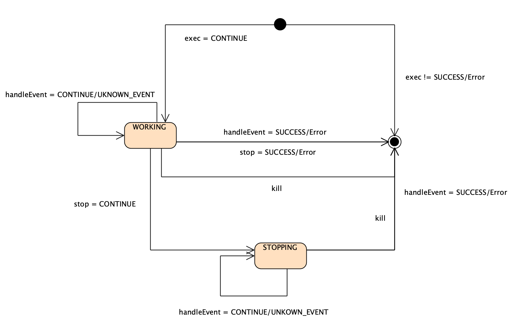

.. _error-handling:

错误处理
=========

当我们为 `Transaction DSL` 框架添加一个Action时，这个Action会组合其它的Action。比如， ``__sequential`` Action，里面会
放入一系列的其它Action，而 ``__procedure`` 则会包含两个Action，一个是Normal Action，一个是 ``__finally`` Action。

做为Action的编写者，你不能假设你的Action所组合的是那种具体的Action。因而任何Action都必须遵从某种约定。
所有的Action，在组合其它Action时，唯一可以作出的假设是每一个Action都遵从这些约定。下面我们将会讨论这些约定。

Action外部行为规范
--------------------

Action从外部看，总共有4个状态，它们的状态转换关系如下图所示：

下面我们对其进行详细说明。

.. _IDLE:

IDLE
++++++++++

任何一个Action ，单纯从外部看，在没有发生任何调用之前，Action必然处于 :ref:`IDLE` 状态。

而 :ref:`IDLE` 状态下，唯一合法的调用是 ``exec`` ，如果 ``exec`` 返回 ``CONTINUE`` 代表Action进入 :ref:`WORKING` 状态。
而 :ref:`WORKING` 的含义是，此Action需要进一步的异步消息激励。

.. _WORKING:

WORKING
+++++++++++++++

在 :ref:`WORKING` 状态下，

1. ``exec`` 不可再被调用，否则应返回 ``FATAL_BUG`` ；
2. 如果有事件到达，可以调用 ``handleEvent`` 进行处理；其可能结果如下：

  - ``SUCCESS`` 代表Action进入 :ref:`DONE` 状态；
  - 任何错误值，也代表Action进入 :ref:`DONE` 状态；
  - ``CONTINUE`` 代表Action依然处于 :ref:`WORKING` 状态；并且这条消息被Action成功的 :ref:`accepted <accepted>` 并处理，
    只是还需要进一步的消息激励；
  - ``UNKNOWN_EVENT`` 表示消息并未被 :ref:`accepted <accepted>` ；

3. 如果调用 ``stop`` ，其可能结果如下：

  - 如果返回 ``CONTINUE`` ，表示Action进入 :ref:`STOPPING` 状态；
  - 如果返回 ``SUCCESS`` ，表示Action进入 :ref:`DONE` 状态；
  - 如果返回错误值，表示Action进入 :ref:`DONE` 状态；

4. 如果调用 ``kill`` ，Action立即应进入 :ref:`DONE` 状态。

.. _STOPPING:

STOPPING
+++++++++++++

在 :ref:`STOPPING` 状态下，

1. ``exec`` 不可再被调用，否则应返回 ``FATAL_BUG`` ；
2. 如果调用 ``stop``，不应对Action产生任何影响，而直接返回 ``CONTINUE`` ;
3. 如果调用 ``kill`` ，应立即进入 :ref:`DONE` 状态
4. 如果调用 ``handleEvent`` , 其可能结果如下：

  - ``SUCCESS`` 代表Action进入 :ref:`DONE` 状态；
  - 任何错误值，也代表Action进入 :ref:`DONE` 状态；
  - ``CONTINUE`` 代表Action依然处于 :ref:`STOPPING` 状态；
  - ``UNKNOWN_EVENT`` 表示消息并未被 :ref:`accepted <accepted>` ；

.. _DONE:

DONE
+++++++++++++

在 :ref:`DONE` 状态下，

1. ``exec`` ， ``stop`` , ``handleEvent`` 都不可再被调用，否则应返回 ``FATAL_BUG`` ；
2. 如果调用 ``kill`` ，应该对Action状态无任何影响，依然处于 :ref:`DONE` 状态。

.. _accepted:
.. attention::
   - 一个Action的 ``handleEvent`` ，只要返回 ``SUCCESS`` ，
     ``CONTINUE`` ，包括大部分错误（某些错误，比如 ``FATAL_BUG`` ，
     表示在此Action已经处于不应该再被调用 ``handleEvent`` 的状态），
     都代表这条消息被 **accepted** ；

   - 而返回 ``UNKNOWN_EVENT`` 则明确代表此消息没有被此Action **accepted** 。

   - 一个消息被 **accepted** ，并不代表一个消息被 **consumed** 。如果没有被 **consumed** ，
     代表此消息依然可以被其它Action处理。

当你的Action组合其它Action时，你对其它Action的假设，只需要符合上述外部行为规范即可。但对于我们将要实现的Action内部，我们也要进行
一些概念上的定义，以保证Action与Action之间组合时，尤其在进行错误处理时，可以相互协调，保证整个 ``Transaction`` 行为的正确性。

Action内部状态
-----------------

.. _I-IDLE:

I-IDLE:
  Action已经被构造，但尚未调用 ``exec`` 之前。

.. _I-DONE:

I-DONE:
  Action已经结束其处理，无论成功还是失败。

如果一个Action在调用 ``exec`` 之后，直接返回 ``SUCCESS`` 或者任何错误，代表这个Action已经进入 :ref:`I-DONE <I-DONE>` 状态。

如果一个Action在调用 ``exec`` 之后，直接返回 ``CONTINUE`` ，代表这个Action已经
进入 :ref:`I-WORKING <I-WORKING>` 或者 :ref:`I-STOPPING<I-STOPPING>` 状态。
这一点与外部的观察并不一致，因为外部无法从 ``CONTINUE`` 返回值辨别出其内部处于二者中的哪一种。

无论是哪一种，从外部看，这个Action都还没有运行结束，因而需要进一步的消息激励。但从内部看，却有着本质的区别：

.. _I-WORKING:

I-WORKING:
   状态却表示其处于正常处理状态；

.. _I-STOPPING:

I-STOPPING:
   则代表Action内部已经进入异常处理状态。

如果内部处于 :ref:`I-WORKING <I-WORKING>` 状态，如果一个Action未处于 :ref:`免疫模式 <immune-mode>` ，
则 ``stop`` 调用应强迫Action进入失败处理。

错误传播
-----------------

方式
+++++++

.. attention::
   错误的传播，主要有三种方式：

   1. 最直接，也是最典型的，通过 ``返回值`` 。这发生于一个Action运行结束，进入 :ref:`I-DONE <I-DONE>` 状态时；
      这属于一个从 ``内层上下文`` 向 ``外层上下文`` 传播错误的方式。
   2. 但一个Action内部发生错误后，并没有直接进入 :ref:`I-DONE <I-DONE>` 状态，而是需要进一步的消息激励，
      因而会处于 :ref:`I-WORKING <I-WORKING>` 或 :ref:`I-STOPPING <I-STOPPING>` 状态。
      但此错误需要立即为外界所感知，从而尽快对此错误作出响应。
      此时，可以通过 ``运行时上下文`` 的嵌套父子关系，由 ``内层上下文`` 直接逐级上报，``向外传播`` ；
   3. ``外层上下文`` 由于任何原因，比如，最典型的原因是，通过内层Action的返回值，或者 ``内层上下文`` 的上报，得到了一个错误，
      需要将错误传递给其它 ``内层上下文`` 。
      此时，可以通过 ``stop`` 调用，带着cause值，将错误 ``由外向内`` 传播。

简单的说就是：

1. 由内向外传播

  - 内层Action的返回值（此时Action进入 :ref:`I-DONE <I-DONE>` 状态）
  - ``内层上下文`` 向 ``外层上下文`` 的直接传递（此时调用返回值是 ``CONTINUE`` ，因而Action
    处于 :ref:`I-WORKING <I-WORKING>` 或 :ref:`I-STOPPING <I-STOPPING>` 状态 ）

2. 由外向内传播：

  - ``stop(cause)``

.. image:: images/ch-4/runtime-env.png
   :align: center
   :scale: 50 %

模式
++++++++

每一个可嵌套Action都有4种模式：

.. _normal-mode:

正常模式：Normal Mode
   错误既可以向内传播，也可以向外传播；

.. _sandbox-mode:

沙箱模式：Sandbox Mode
   - 错误不可通过 ``运行时上下文`` 向外传播
   - 可能允许通过 ``返回值`` 返回最终的错误；
   - 允许外部的错误通过 ``stop`` 传播进来；

.. _immune-mode:

免疫模式：Immune Mode
   - 错误不可向内传播
   - 但允许内部的错误通过 ``运行时上下文`` 或者 ``返回值`` 向外传播

.. _island-mode:

孤岛模式：Island Mode
   - 同时处于 :ref:`沙箱模式 <sandbox-mode>` 和 :ref:`免疫模式 <immune-mode>`

.. attention::
   每一个可嵌套Action的设计，必须遵从如下原则：

   - 如果本来处于 :ref:`正常模式 <normal-mode>` ，一旦被调用 ``stop`` ，如果 ``stop`` 没有导致
     其进入 :ref:`I-DONE <I-DONE>` 状态，则必然进入 :ref:`免疫模式 <immune-mode>` ; 随后再次调用其 ``stop`` 将会被阻断，
     直接返回 ``CONTINUE`` ，而不会对其产生任何影响；
   - 如果处于 :ref:`正常模式 <normal-mode>` 或 :ref:`免疫模式 <immune-mode>` ，在内部发生错误后，如果随后不能立即结束，则必须通过 ``运行时上下文`` 及时上报错误；
   - 一旦通过 ``运行时上下文`` 上报过一次错误，则随后再发生的错误，禁止再通过 ``运行时上下文`` 上报。这就意味着，
     进入了 :ref:`沙箱模式 <sandbox-mode>` （从 :ref:`正常模式 <normal-mode>` ）或 :ref:`孤岛模式 <island-mode>` （从 :ref:`免疫模式 <immune-mode>` ）。

stop的设计原则
++++++++++++++++++++++++

.. attention::
   ``stop`` (立即结束的情况) 或随后的 ``handleEvent`` （经多次消息激励后的情况）的返回值原则如下：

   - 如果 ``stop`` 并没有导致一个Action处理失败，即Action依然完成了它本来的职责， 则依然返回 ``SUCCESS`` ；
   - 如果 ``stop`` 本身没有失败，但Action并没有完成它本来应该完成的任务，则返回 ``FORCE_STOPPED`` ；
   - 如果 ``stop`` 导致了的其它失败，则返回其它错误；
   - 如果一个Action从未被调用过 ``stop`` ，或者即便被调用，但错误被阻断，则永远也不应该返回 ``FORCE_STOPPED`` 。

部分action行为定义
-----------------------

**__asyn**
++++++++++++

.. attention::
   当一个 ``__asyn`` 处于 :ref:`I-WORKING <I-WORKING>` 状态，即其正在等待消息激励时，如果被调用 ``stop`` ：

   - 如果用户实现有错误（返回 ``CONTINUE`` 却发现其并没有等待任何消息），直接返回 ``USER_FATAL_BUG`` 。
   - 否则，返回 ``FORCE_STOPPED`` 。

.. attention::
   当一个 ``__asyn`` 处于 :ref:`I-WORKING <I-WORKING>` 状态，某次调度时发生一个内部错误，
   则应该返回此错误，并进入 :ref:`I-DONE <I-DONE>` 状态。

**__sequential**
+++++++++++++++++

.. attention::
   当 ``__sequential`` 处于 :ref:`I-WORKING <I-WORKING>` 状态，如果此时调用其 ``stop`` ：

   1. 立即对当前action调用 ``stop`` ，将 ``cause`` 值透传；
   2. 如果其立即返回错误，则直接将此错误返回；进入 :ref:`I-DONE <I-DONE>` 状态；
   3. 如果立即返回 ``SUCCESS`` ，也进入 :ref:`I-DONE <I-DONE>` 状态：

     - 如果这是 ``__sequential`` 序列的最后一个action，则返回 ``SUCCESS`` ；
     - 否则，返回 ``FORCE_STOPPED`` 。

   4. 如果当前action并未直接结束，而是返回 ``CONTINUE`` ，则进入 :ref:`孤岛模式 <island-mode>` ；
   5. 等某次调用 ``handleEvent`` 返回 ``SUCCESS`` 或错误时，其处理与 2，3所描述的方式相同。

.. attention::
   当 ``__sequential`` 处于 :ref:`I-WORKING <I-WORKING>` 状态，如果其中某一个action发生错误：

   - 直接返回此错误，进入 :ref:`I-DONE <I-DONE>` 状态。

**__concurrent**
+++++++++++++++++++

.. attention::
   当 ``__concurrent`` 处于 :ref:`I-WORKING <I-WORKING>` 状态，如果此时调用其 ``stop`` ：

   - ``stop`` 每一个处于 :ref:`I-WORKING <I-WORKING>` 状态的线程， 将 ``cause`` 值继续往内层传递；
   - 如果所有的线程都最终以 ``SUCCESS`` 结束，则返回 ``SUCCESS`` ；
   - 如果某个或某些线程返回任何错误，整个 ``__concurrent`` 结束时，返回最后一个错误。

.. attention::
   当 ``__concurrent`` 处于 :ref:`I-WORKING <I-WORKING>` 状态，此时某一个线程发生错误：

   - 记录下此错误；
   - 对其余任何还处于 :ref:`I-WORKING <I-WORKING>` 状态的线程，调用其 ``stop`` ，原因为刚刚发生的错误；
   - 如果某个线程最终返回 ``FORCE_STOPPED`` ，忽略此错误；
   - 在整个 ``stop`` 过程中，坚持使用同一个原因值；哪怕某些线程立即返回其它错误值；
   - 如果在整个 ``stop`` 过程中，有一个或多个直接返回其它错误值（非 ``FORCE_STOPPED`` )，
     等 ``stop`` 调用完成后，将最后一个错误记录下来，更新原来的错误值；
   - 如果所有线程都在调用 ``stop`` 后立即结束，则直接返回最后一个错误值；进入 :ref:`I-DONE <I-DONE>` 状态；
   - 如果仍然有一个或多个线程，其 ``stop`` 调用返回 ``CONTINUE`` ，则 ``__concurrent`` 应
     直接给外层上下文通报最后一个错误，并返回 ``CONTINUE`` ，
     由此进入 :ref:`孤岛模式 <island-mode>` 以及 :ref:`I-STOPPING <I-STOPPING>` 状态。
   - 随后在 ``handleEvent`` 的过程中，返回的每一个错误，都即不向外扩散，也不向内扩散；
     仅仅更新自己的last error（ ``FORCE_UPDATE`` 除外）；
   - 最终结束后，返回最后一个错误值。进入 :ref:`I-DONE <I-DONE>` 状态。

**__procedure**
+++++++++++++++++

``__procedure`` 分为两个部分：Normal Action，与 ``__finally`` Action。

.. _procedure-stop:

.. attention::
   Normal Action的执行如果处于 :ref:`I-WORKING <I-WORKING>` 状态，此时进行 ``stop`` ：

   1. 直接对Normal Action调用 ``stop`` ；

     - 如果直接返回 ``SUCCESS`` ，则直接以成功状态，进入 ``__finally`` ；
     - 如果直接返回错误，则直接以错误进入 ``__finally`` ；
     - 两种情况下，在 ``__finally`` 里读到的环境状态都是Normal Action结束时的返回值；

   2. 如果Normal Action返回 ``CONTINUE`` ，则 ``__procedure`` 进入 :ref:`孤岛模式 <island-mode>` 。
   3. 随后Normal Action的 ``__handleEvent`` 如果返回 ``SUCCESS`` 或错误，其处理方式与1所描述的情况相同；

.. attention::
   Normal Action的执行如果处于 :ref:`I-WORKING <I-WORKING>` 状态，如果此时其内部上报了一个错误，但Normal Action的执行
   并没有立即结束（返回 ``CONTINUE`` ） :

   1. 记录并继续通过 ``运行时上下文`` 向外传递此错误；并进入 :ref:`孤岛模式 <island-mode>` ；
   2. 继续调度Normal Action运行直到其结束；
   3. 如果Normal Action最终返回一个错误（理应返回一个错误），记录下此错误；
   4. Normal Action结束后，直接进入 ``__finally`` ，在 ``__finally`` 里读到的环境状态之前发生的最后一个错误值；

.. attention::
   - 无论任何原因，一旦开始执行 ``__finally`` Action，将直接进入 :ref:`免疫模式 <immune-mode>` （也
     可能是 :ref:`孤岛模式 <island-mode>` ）；
   - 在进入 ``__finally`` 之后，如果仅仅是 :ref:`免疫模式 <immune-mode>` ，
     而不是 :ref:`孤岛模式 <island-mode>` ， 则依然可以给外围环境通报错误；
   - 在 ``__finally`` 里，如果读到的错误码是 ``FORCE_STOPPED`` ，可再读取 ``stop_cause`` 。

**__prot_procedure**
++++++++++++++++++++++++

.. attention::
   一个处于 :ref:`I-WORKING <I-WORKING>` 状态的 ``__prot_procedure`` 可以被 ``stop`` ，
   其处理方式与 :ref:`procedure stop <procedure-stop>` 相同。

.. attention::
   ``__prot_procedure`` 天然处于 :ref:`沙箱模式 <sandbox-mode>` ，即，直到其运行结束之前，不会向外围运行时上下文通报任何错误。

**__time_guard**
++++++++++++++++++++

.. attention::
   一个处于 :ref:`I-WORKING <I-WORKING>` 状态的 ``__time_guard`` 被 ``stop`` 后，action会首先被 ``stop`` :

   1. 如果 ``stop`` 导致action立即结束，此时timer也会被stop，并返回action的执行结果；
   2. 如果 ``stop`` 后，action依然没有结束运行（返回 ``CONTINUE`` )，则定时器也不终止；但 ``__time_guard`` 立即
      进入 :ref:`免疫模式 <immune-mode>` ；``stop`` 之后，经过一系列的消息激励，直到运行结束：

     - 如果期间没有timeout，则以action的最终返回值做为 ``__time_guard`` 的返回值；
     - 如果期间发生了timeout，而action的最终返回值为 ``SUCCESS`` 或者 ``FORCE_STOPPED`` ，则返回 ``TIMEDOUT`` 。

.. attention::
   一个处于 :ref:`I-WORKING <I-WORKING>` 状态的 ``__time_guard`` 在运行期间，监测到一个由action上报的一个内部错误，
   则立即进入 :ref:`免疫模式 <immune-mode>` 。之后，经过一系列的消息激励，直到运行结束：

     - 如果期间没有timeout，则以action的最终返回值做为 ``__time_guard`` 的返回值；
     - 如果期间发生了timeout，而action的最终返回值为 ``SUCCESS`` 或者 ``FORCE_STOPPED`` ，则返回 ``TIMEDOUT`` 。

