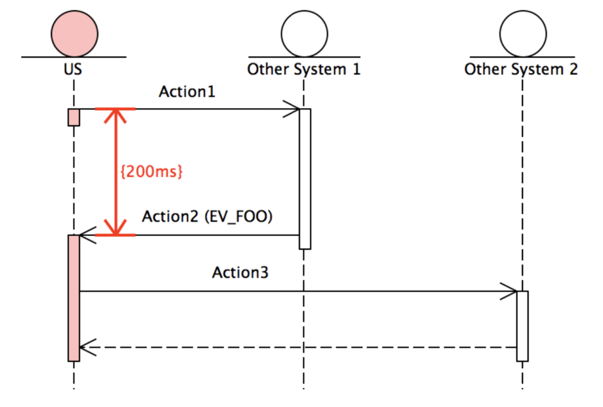
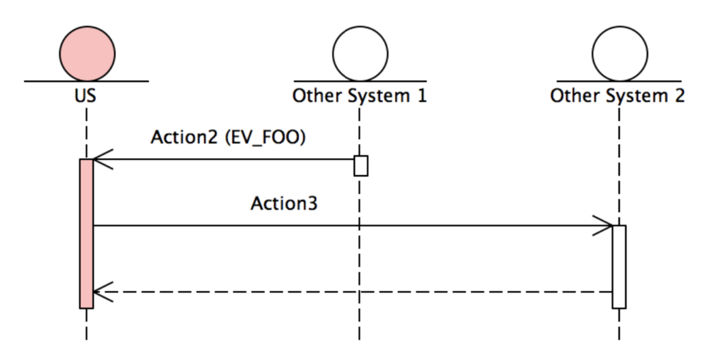

事件
======

正常来讲，对于具体的事件不应该是 `Transaction DSL` 层面应该关注的事情，它需要做的就是将收到事件派发给由用户编写的基本操作。
具体基本操作打算如何处 理这些事件，那是那个层面应该关心的问题。

但在某些场景下，将对具体事件的关注放在 `Transaction DSL` 内，将会大大方便用户的实现。

**__wait**
-------------------

首先的一种场景是，当一个事务执行到某个点的时候，会期待某个事件的发生，但是，事件的内容并不重要(或干脆没有内容)，此时，
一个事件就像一个 ``signal`` 一样。如果由基本操作来关心这个事件，则用户不得不按照固定的模式编写一个类，以期待这个事件，
并在收到这个事件后，返回 ``SUCCESS`` , 比如:

.. code-block::

   DEF_SIMPLE_ASYNC_ACTION(Action1) {
     auto exec(const TransactionInfo&) -> Status {
       return WAIT_ON(EV_SOMETHING, handleSomethingEvent);
     }
   private:
     auto handleSomethingEvent(TransactionInfo const&, Event& const) -> Status {
        return SUCCESS;
     }
   };

这无疑是一件相当无聊的工作。为了方便于实现这样的场景，用户可以在 `Transaction DSL` 中使用 ``__wait`` 来完成相同的事情。如下:

.. code-block::

   __transaction
   ( ...
   , __wait(EV_SOMETHING)
   , ... );

**__peek**
------------------------

在一些场景下，一个消息可能两个操作都关注，但是，放在前面的操作仅仅关心消息的到达，而放在后面的操作则更关心消息的内容。

这种情况下，前者可以使用 ``__peek`` 来探测一个消息是否到达，但它并不处理这个消息，所以调度器还会进一步将消息传递给后续的流程。
比如，下面的两个事务，事务 2 和事务 1 相比，只是多了一个主动发起的请求，以及等对方回应命令的时间约束。

这种情况下，事务 2 所描述的过程事实上是个可复用的整体。但是，由于事务 1 中的那个定时器约束的是从请求发出到命令到达的时间。
所以，你很难从已有的手段中找到一种优雅简洁的表达来进行复用。

而借助于 ``__peek`` ，这个问题就迎刃而解。

.. code-block::

   __def(Trans2) __as
   ( __sync(Action2)
   , __asyn(Action3));

   __transaction
   ( __time_guard
       ( TIMER_1
       , __sync(Action1)
       , __peek(EV_FOO))
   , __apply(Trans2));

   __transaction
   ( __apply(Trans2) );

并不难看出， ``__peek`` 和 ``__wait`` 的唯一差别是， ``__wait`` 会把消息吃掉，而 ``__peek`` 则只看一眼，
然后把消息留给后续的操作。