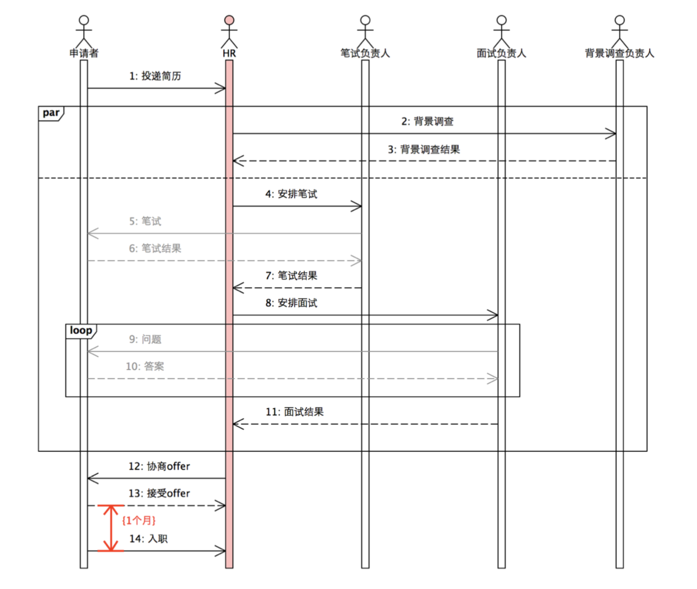
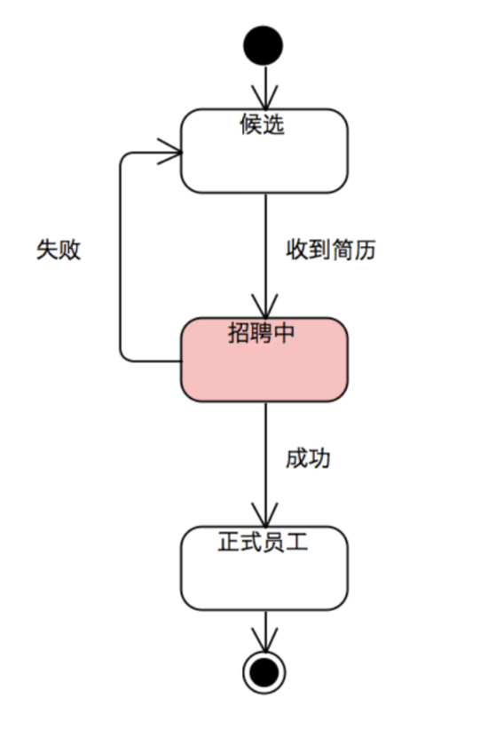
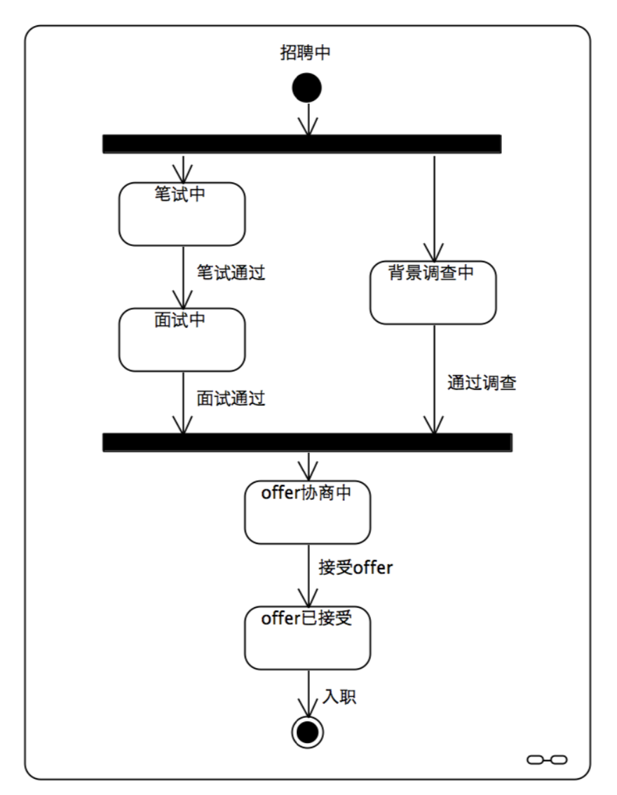

动机
========

我们先从大家都熟悉的一个例子说起。

任何一家企业都需要招聘员工。描述的是某家企业制定的招聘流程图:

正如图中所描述的，流程的起始是收到应聘者投递的简历，而成功招聘到一个人的标志是：应聘者入职。

现在，我们用软件实现这个过程，其中，每个角色都是一个独立的系统或子系统，他们之间必须通过 **消息** 或 **事件** 进行通信。
如果，我们现在需要实现HR子系统，该如何做?

状态机
------------

**状态机** 是大多数基于消息的异步系统常用的实现方式。所以HR为一个应聘者设计了如图所示的状态机:

.. image:: images/ch-1/recruting-state.png
   :scale: 50 %
   :align: center

**状态模型** 和 **序列模型** 都能较好的反映一件事情的本质，但不同的是，**序列模型** 更加专注于目标系统的 **行为**，
而 **状态模型** 更关注被操作对象的 **状态迁移** 。

但从实现的角度来看，如果你选择 **序列模型** ，当然，你需要实现目标系统的 **行为** ；而如果你选择 **状态模型** ，那么除了需要管理 **状态机** 之外，
你仍然需要处理目标系统的 **行为** 。这就意味着，在实现层面，一旦选择 **状态模型** ，就需要做许多额外的工作。

而这部分额外的工作绝不是轻松和愉快的

首先，**状态机** 应该管理每个状态下期望的激励，对于未期望的消息则应该忽略。
比如，在本例中，一个正处于 *“笔试中”* 状态的状态机，如果收到了一个 *“接受offer”* 消息，将是一件很奇怪的事情，所以，只能忽略它。
一个成熟的团队，对于状态机的管理往往会引入一个状态机引擎。一个典型的引擎需要程序员自己定义一张状态表，然后注册给引擎。

.. code-block:: c++

    const StateTable states[] = {
      // ...
      { STATE_EXAM,     { {EV_EXAM_RESULT, handleExamResult}}},
      { STATE_INTERVIEW,{ {EV_INTERVIEW_RESULT, handleInterviewResult}}}, // ...
      { STATE_OFFERED,  { {EV_ONBOARD, handleOnBoard}
                        , {EV_TIMEOUT, handleTimedout} }}
    };
 
有些引擎则呈现出另外一种形式，但本质上没有任何不同:

.. code-block:: c++

   Status STATE_OFFERED_Handler(const Event& event) {
     switch(event.getEventId())
     {
       case EV_ONBOARD : return handleOnBoard(event); 
       case EV_TIMEOUT : return handleTimedout(event); 
       default: // error log
     }
     return SUCCESS; 
   }

然后，在具体的 **事件处理函数** 中，首先要处理这条消息，然后再根据处理的结果进行状态迁移。比如:

.. code-block:: c++

  Status handleExamResult(const Event& event) {
    ExamResult* result = (ExamResult*)event.getContent();
    if(result->pass) {
      // 处理消息 
      arrangeInterview();
      // 状态迁移 
      gotoState(STATE_INTERVIEW);
    } else {
      // 处理消息
      reject();
      // 状态迁移 
      gotoState(STATE_IDLE);
    }
    return SUCCESS;
  }

从上述实现可以看出，对于 **状态模型** 来说，其图形描述和代码实现之间存在很大的鸿沟。
因为在任何一个成熟的 **状态机引擎** 中，由用户所定义的状态表仅仅描述了一个
状态机所拥有的所有状态，以及每个状态期望的激励，却没有描述状态之间的 **迁移** 。

这是因为，如果想让状态机也能够描述状态迁移，就必须让状态机的迁移是确定的，
这就会导致某些状态机的设计不得不进行转换，而转换的结果往往会失去直观性。
所以，为了拥有灵活性，状态的迁移只能由各个事件处理函数来完成。

因此，为了在代码层面理解一个 **状态机** 的设计，必须仔细的阅读相关代码，
并在不同代码间来回跳转（因为状态一直在跳转），才能理解一个状态机的全貌。

另外，**状态机引擎** 只能负责状态的管理，功能非常单一。所以，除了状态管理之外的
所有其它细节，都必须有用户亲自实现。比如，本例中的时间约束，用户就必须亲自操作定时器:

.. code-block:: c++

  Status handleOfferAccepted(const Event& event) {
    // ...
    // 启动定时器，以确保应聘者可以按时入职
    ASSERT_SUCC(startTimer(TIMER_ONBOARD));

    // ...
    // 状态迁移
    gotoState(STATE_OFFERED);

    // ...
  }

  Status handleOnBoard(const Event& event) {
    // ...
    // 应聘者已入职，关掉相应的定时器
    ASSERT_SUCC(stopTimer(TIMER_ONBOARD));

    // ...
    // 状态迁移
    gotoState(STATE_HIRED);

    // ...
  }

而对于的复杂的系统而言，由于各种并发，及并发的丰富组合，要么会导致状 态的急剧膨胀，以至于状态机及其的晦涩，难以理解和维护。

为了避免状态机的膨胀，程序员会选择使用一些记录状态会合的标记位(这本 质上仍然是一种状态扩展)，以表示多个并行是否可以会合，并在执行过程中对这 些状态位进行检查。

.. code-block:: c++

  Status handleInterviewResult(const Event& event) {
    InterviewResult* result = (InterviewResult*)event.getContent();

    // ...
    if(result->pass) {
      // 背景检查已通过?
      if(backgroundCheckPass()) {
         startOfferNegotiation();
         gotoState(STATE_OFFER_NEGO);
      }
    }

    // ...
  }

  Status handleBackgroundResult(const Event& event) {
    BackgroundResult* result = (BackgroundResult*)event.getContent();

    // ...
    if(result->pass) {
      // 面试已通过?
      if(interviewPass()) {
        startOfferNegotiation();
        gotoState(STATE_OFFER_NEGO);
      }
    }

    // ...
  }

同步模型
-------------

我们已经看到，**状态模型** 在实现层面带来了一系列的复杂度。我们如何才能降低这种复杂度?

事实上，稍加思考，就不难发现，在本例中，一个应聘者真正的状态只有两个，一个是 *候选* 状态，一个是 *正式员工* 状态。

而从候选到正式员工之间是一个 **转换** （Transition）。众所周知，转换是一个连续的 **过程** ，而不是 **状态** 。
如果非要将其称为一个 **状态** ，它的本质属性也和另外两个状态不同，它属于一种不稳定的 **临时中间状态** 。如图所示:

作为一个 **转换** ，和简单的转换不同的是，它是一个 **异步过程** ，需要大费周章之后才能完成。
为了能够控制这个异步过程，才不得不引入状态模型。

但是，如果能将其转化为 **同步过程** 的话，那些 **临时中间状态** 就失去了意义。我们也就无需再为之引入复杂的状态机。

所以，为了简化异步消息所带来的状态控制，有些设计师会选择通过框架，将一个顺序的异步过程转化为同步过程。

在一个同步过程里，一个系统或子系统一旦发出一个请求消息，并需要等待其应答，则当前进程/线程就会进入休眠态，
直到应答消息来临或超时为止。在此期间，所有发给此进程的其它消息将无法得到处理。如图所示:

.. image:: images/ch-1/recruting-seq.png
   :align: center

如果控制过程比较简单，而此应答消息正是其期待的唯一消息的话，这无疑是一种非常聪明而简单的处理。

不幸的是，对于稍微复杂的实时系统而言，这样的做法很多时候无法满足实时性的需要。

比如并发问题。sleep-wakeup模型无法做到同时处理多个并发的异步过程。而并发，则是一个异步系统为了满足实时性和性能的必要手段。

这种情况下，一旦需要并发，同步模型就必须启动OS线程以进行应对。由此， 程序员就不得不编写相关的进程/线程间通信和同步的代码，
而这些实现也散乱在 系统的各处，无法和序列图中的内容建立起直观的映射关系。

事务
---------

现在，我们似乎陷入了两难的境地:由于异步过程的存在，及异步过程实时性的要求，我们不能总是简单的将异步过程同步化。
既然不能同步化，为了良好的控 制一个任意复杂度的异步过程，我们似乎只剩下了一种手段——状态机；
而状态机实现所带来的一系列复杂度又不是我们真正想要的。(这个复杂度难道真是 **内在** 的， 而不是 **偶发** 的吗?)

现在，我们再回到 *“招聘中”* 这个临时状态中，仔细的观察一下它的特点，如图所示:

不难发现，这个过程中的任何步骤发生失败都会导致整个转换失败，只有全部成功之后，整个转换才算成功。
这就让它成为一个不可分割的原子操作。要么全部成功，要么全部失败（之前通过的考核也统统失去了意义）。

而这正符合一个源自于数据处理的概念： **事务** （Transaction）。下面是 Wikipedia 对 **事务** 的定义:

.. epigraph::

   In computer science, transaction processing is information processing that is divided into individual,
   indivisible operations, called transactions. Each transaction must succeed or fail as a complete unit;
   it cannot remain in an intermediate state.

现在，事物的原貌已经浮出水面：图中描述的才是真正的 **状态机** ，而图中描述的过程则是一个 **事务**。

对于前者，我们仍然使用 **状态模型** 来表示；而对于后者，我们则需要引入更准确的模型—— **事务模型** ——来解决。

Transaction DSL
---------------------

**事物模型** 用来描述状态之间的 **转换过程** ：它可以由一系列的 **同步** 和 **异步** 操作（Action）组成。

而 `Transaction DSL` 则是一种用来描述事务的语言。它用来定义状态之间的复杂转换过程。
从而避免使用状态机来描述状态转换过程中由于异步而导致的 **临时中间状态** 。

`Transaction DSL` 不是为了取代 **状态模型** ，而是为了提供一种方法，以解决那些本来不应该属于状态模型，
却在使用状态模型进行解决的问题。从而大大简化实现的复杂度，并缩小用户视图和实现视图之间的距离，
让设计和实现更加符合事情的原貌，最终降低开发和维护成本。

在下面的章节里，我们将会展示：我们如何通过 `Transaction DSL` 来定义一个事务。

