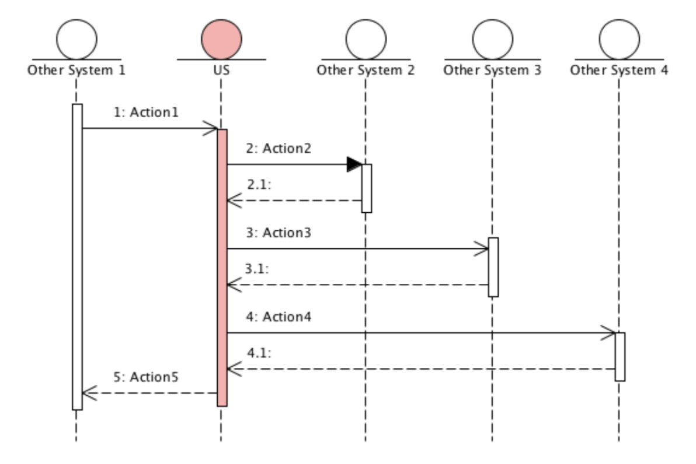

快速开始
============

我们先通过一系列简单的例子，来对 `Transaction DSL` 有一个直观的认识。

如图所示，站在 US 的角度，一个完整的事务操作，共分为5个步骤:

  1. 从 `Other System 1` 收到一条请求消息;
  2. 对 `Other System 2` 进行了一个函数调用;
  3. 对 `Other System 3` 发送了一条异步消息，并等待其应答消息;
  4. 对 `Other System 4` 发送了一条异步消息，并等待其应答消息;
  5. 给 `Other System 1` 发送了一条应答消息。

定义事务
--------------

使用 `Transaction DSL` ，我们将上面序列图中的过程定义为:

.. code-block:: c++

  __def_transaction (
    __sequential
      ( __asyn(Action1)
      , __sync(Action2)
      , __asyn(Action3)
      , __asyn(Action4)
      , __sync(Action5))
  ) Transaction;

这段代码定义了一个名为 ``Transaction`` 的事务。它由一个包含了 5 个步骤的 **顺序操作** （Sequential Action）构成。
每个步骤都是一个 **基本操作** （Atom Action）。

**基本操作** 共分为两类： **同步操作** (Synchronous Action)和 **异步操作** (Asynchronous Action)。

任何无需进一步等待后续消息的 `Action`，都称作 **同步操作**。这包括：函数调用，以及只发消息、不等回应的操作。
它们都需要通过 ``__sync`` 来指明。但为了更加清晰的区分究竟一个同步操作属于哪种具体类型，你可以使用 ``__call`` 来说明一个操作是函数调用，
用 ``__ind`` 来说明这是一个发送指示消息的操作，用 ``__rsp`` 来说明一个操作是对之前某个请求的一个应答。

任何需要等待异步消息的操作，都称作 **异步操作** 。这包括：典型的 *请求-应答* 操作，消息触发的操作等。
而异步操作则需要通过 ``__asyn`` 来说明。同样的，你可以使用其它一些更加具体的修饰来明确一个异步操作的类型。
比如：你可以使用 ``__req`` 来说明这是一个消息触发型的请求操作。

所以，之前的例子可以修改为：

.. code-block:: c++

  __def_transaction (
    __sequential
      ( __req(Action1)
      , __call(Action2)
      , __asyn(Action3)
      , __asyn(Action4)
      , __rsp(Action5))
  ) Transaction;

现在，我们可以看出，这段代码是对上述序列图简单而直接的描述。

定义基本操作
----------------------------

为了让上述代码可以工作，你需要实现其中的基本操作。事实上，无论一个事务有多么复杂，最终总是由基本操作组成，
你需要做的事情就是定义这些基本操作，然后使用 `Transaction DSL` 来描述它们运行的方式和顺序。

我们之前已经提到，基本操作分为两种： **同步操作** 和 **异步操作** 。定义它们时需要直接或间接从下面两个接口继承。

.. code-block:: c++

  struct SyncAction {
    virtual Status exec(const TransactionInfo&) = 0;
    virtual ~SyncAction() = default;
  };

.. code-block:: c++

  struct Action : SyncAction {
    virtual Status handleEvent(const TransactionInfo&, const Event&) = 0;
    virtual void stop(const TransactionInfo&) = 0;
    virtual ~Action() = default;
  };

对于同步操作，你需要做的就是实现 ``SyncAction`` 接口，它只有一个方法: ``exec``。
对于函数调用型的同步操作，其实现非常简单，其返回值为 ``SUCCESS`` 代表此操作成功，如果返回错误值则表示此操作失败。

.. code-block:: c++

  struct Action2 : SyncAction {
    Status exec(const TransactionInfo&) {
      return OtherSystem::func();
    }
  };

对于 ``Action5`` ，尽管它发送了消息，却无需等待任何消息，所以它也是一个 **同步操作** 。

.. code-block:: c++

  struct Action5 : SyncAction {
    Status exec(const TransactionInfo&) {
      // 构建并发送消息
      Response1 response;
      response.build();
      return sendResponseTo(OTHER_SYSTEM1_PID, response);
    }
  };

而对于异步操作，存在一些常用的模式。大多数情况下，你不需要直接实现 ``Action`` 接口，
而是根据模式从已存在的基类中继承。比如：如果一个异步操作属于简单的 *请求-应答* 模式，你只需要从 ``SimpleAsyncAction`` 继承即可。

